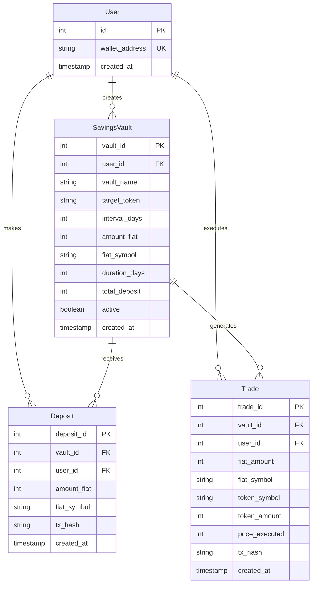

# 📚 Blockberry App - Complete Documentation Index

## 🎯 Project Overview

**Blockberry App** is a Sui blockchain-based Dollar Cost Averaging (DCA) platform inspired by Kraken's DCA functionality. This NestJS application leverages the Cetus Aggregator to find and execute the cheapest USDC → Wrapped BTC swaps across Sui DEXes.

### 🚀 Quick Start
- **Setup Guide**: [SETUP.md](./SETUP.md)
- **Main README**: [README.md](./README.md)
- **API Documentation**: http://localhost:3000/api (Swagger UI)

---

## 🏗️ Architecture Overview

### Technology Stack
```yaml
Backend:      NestJS + TypeScript
Database:     PostgreSQL (Neon Cloud)
ORM:          TypeORM
API Docs:     Swagger/OpenAPI
Blockchain:   Sui Network
DEX:          Cetus Protocol
Package Mgr:  pnpm
```

### Core Components
```
blockberry-app/
├── 📁 src/                     # Source code
│   ├── 🎛️ app.module.ts         # Root application module
│   ├── 🚀 main.ts               # Application entry point
│   │
│   ├── 📊 api/                  # Main DCA API endpoints
│   ├── 👥 users/                # User management system
│   ├── 💰 savings-vault/        # DCA configuration management
│   ├── 💳 deposits/             # Deposit tracking system
│   ├── 📈 trades/               # Trade execution & history
│   │
│   ├── 🌊 sui/                  # Sui blockchain integration
│   ├── 🐋 cetus/                # Cetus DEX aggregator
│   ├── 💲 price/                # Price feed services
│   ├── 📖 orderbook/            # Order book management
│   ├── 🔗 sui-rpc/              # Sui RPC client
│   └── 📊 analytics/            # Performance analytics
│
├── 📄 package.json              # Dependencies & scripts
├── 🔧 tsconfig.json             # TypeScript configuration
├── ⚙️ nest-cli.json             # NestJS CLI configuration
└── 📚 Documentation files
```

---

## 📋 Module Documentation

### 🎛️ Core Application (`app.module.ts`)
**Purpose**: Root module that orchestrates all application components
- **Database**: PostgreSQL with TypeORM integration
- **Configuration**: Environment-based config management
- **SSL**: Configured for Neon Cloud PostgreSQL
- **Development**: Auto-sync & logging enabled

### 🚀 Application Entry (`main.ts`)
**Purpose**: Bootstrap the NestJS application
- **Port**: Configurable via environment (default: 3000)
- **CORS**: Enabled for cross-origin requests
- **Swagger**: Auto-generated API documentation
- **Validation**: Global validation pipes

---

## 🎯 Feature Modules

### 👥 Users Module (`/users`)
**Purpose**: Wallet-based user management system

**Files**: 
- `users.controller.ts` - REST API endpoints
- `users.service.ts` - Business logic
- `users.module.ts` - Module configuration
- `entities/user.entity.ts` - Database entity
- `dto/create-user.dto.ts` - Data transfer objects

**Key Features**:
- Wallet address-based authentication
- Unique wallet constraint
- User lifecycle management

**API Endpoints**:
```http
POST   /users                    # Create new user
GET    /users                    # List all users
GET    /users/:id                # Get user by ID
GET    /users/wallet/:address    # Get user by wallet
DELETE /users/:id                # Delete user
```

### 💰 Savings Vault Module (`/savings-vault`)
**Purpose**: DCA strategy configuration and management

**Files**:
- `savings-vault.controller.ts` - REST API endpoints
- `savings-vault.service.ts` - Business logic
- `savings-vault.module.ts` - Module configuration
- `entities/savings-vault.entity.ts` - Database entity
- `dto/create-savings-vault.dto.ts` - Data transfer objects

**Key Features**:
- DCA strategy configuration (amount, interval, duration)
- Target token specification (BTC, ETH, etc.)
- Fiat currency support (KRW, USD, etc.)
- Active/inactive state management
- Total deposit tracking

**API Endpoints**:
```http
POST   /savings-vault                   # Create vault
GET    /savings-vault                   # List all vaults
GET    /savings-vault/:vault_id         # Get vault by ID
GET    /savings-vault/user/:user_id     # Get user's vaults
PATCH  /savings-vault/:vault_id/active  # Toggle active state
DELETE /savings-vault/:vault_id         # Delete vault
```

### 💳 Deposits Module (`/deposits`)
**Purpose**: Track and manage user deposits to savings vaults

**Files**:
- `deposits.controller.ts` - REST API endpoints
- `deposits.service.ts` - Business logic
- `deposits.module.ts` - Module configuration
- `entities/deposit.entity.ts` - Database entity
- `dto/create-deposit.dto.ts` - Data transfer objects

**Key Features**:
- Deposit amount tracking
- Transaction hash recording
- Multi-currency support
- Balance calculation
- Vault association

**API Endpoints**:
```http
POST   /deposits                 # Record new deposit
GET    /deposits                 # List all deposits
GET    /deposits/:deposit_id     # Get deposit by ID
GET    /deposits/user/:user_id   # Get user's deposits
GET    /deposits/vault/:vault_id # Get vault's deposits
GET    /deposits/balance         # Calculate balances
DELETE /deposits/:deposit_id     # Delete deposit
```

### 📈 Trades Module (`/trades`)
**Purpose**: Execute and track DCA trades

**Files**:
- `trades.controller.ts` - REST API endpoints
- `trades.service.ts` - Business logic
- `trades.module.ts` - Module configuration
- `entities/trade.entity.ts` - Database entity
- `dto/create-trade.dto.ts` - Data transfer objects

**Key Features**:
- Trade execution tracking
- Price point recording
- Token amount calculation
- Performance analytics
- Transaction verification

**API Endpoints**:
```http
POST   /trades                 # Record new trade
GET    /trades                 # List all trades
GET    /trades/:trade_id       # Get trade by ID
GET    /trades/user/:user_id   # Get user's trades
GET    /trades/vault/:vault_id # Get vault's trades
DELETE /trades/:trade_id       # Delete trade
```

### 📊 API Module (`/api`)
**Purpose**: High-level DCA operations and orchestration

**Files**:
- `api.controller.ts` - Main DCA API endpoints
- `api.module.ts` - Module configuration

**Key Features**:
- Vault creation with user management
- Deposit processing
- Trade execution
- Wallet verification
- Transaction history

**API Endpoints**:
```http
POST /api/create-savings  # Create savings vault
POST /api/deposit         # Process deposit
POST /api/execute-buy     # Execute DCA buy
GET  /api/transactions    # Get transaction history
GET  /api/verify-wallet   # Verify wallet address
```

---

## 🌊 Blockchain Integration Modules

### 🌊 Sui Module (`/sui`)
**Purpose**: Core Sui blockchain integration

**Files**:
- `sui.service.ts` - Sui SDK wrapper
- `sui.module.ts` - Module configuration

**Key Features**:
- Sui client initialization
- Transaction building
- Account management
- Network configuration

### 🐋 Cetus Module (`/cetus`)
**Purpose**: Cetus DEX aggregator integration

**Files**:
- `cetus.service.ts` - Cetus API wrapper
- `cetus.module.ts` - Module configuration

**Key Features**:
- Liquidity pool discovery
- Best price routing
- Swap execution
- Fee calculation

### 💲 Price Module (`/price`)
**Purpose**: Real-time price feeds and market data

**Files**:
- `price.service.ts` - Price data service
- `price.module.ts` - Module configuration

**Key Features**:
- CoinGecko integration
- Price history tracking
- Market data aggregation
- Currency conversion

### 📖 OrderBook Module (`/orderbook`)
**Purpose**: Order book analysis and trading insights

**Files**:
- `orderbook.service.ts` - Order book service
- `orderbook.module.ts` - Module configuration

**Key Features**:
- Depth analysis
- Spread calculation
- Liquidity assessment
- Market impact estimation

### 🔗 Sui RPC Module (`/sui-rpc`)
**Purpose**: Direct Sui RPC communication

**Files**:
- `sui-rpc.service.ts` - RPC client service
- `sui-rpc.module.ts` - Module configuration

**Key Features**:
- Raw RPC calls
- Custom query support
- Network monitoring
- Performance optimization

### 📊 Analytics Module (`/analytics`)
**Purpose**: Performance tracking and user analytics

**Files**:
- `analytics.controller.ts` - Analytics API
- `analytics.service.ts` - Analytics computation
- `analytics.module.ts` - Module configuration

**Key Features**:
- DCA performance metrics
- Comparison with CEX prices
- "Alpha" calculation (savings vs fixed-time purchases)
- User behavior analysis

---

## 🗄️ Database Schema

### Entity Relationships


### Table Details

#### `users` Table
| Column | Type | Description |
|--------|------|-------------|
| id | SERIAL PRIMARY KEY | Auto-increment user ID |
| wallet_address | VARCHAR UNIQUE | Sui wallet address (unique) |
| created_at | TIMESTAMP | Account creation time |

#### `savings_vault` Table
| Column | Type | Description |
|--------|------|-------------|
| vault_id | SERIAL PRIMARY KEY | Auto-increment vault ID |
| user_id | INTEGER FK | Reference to users.id |
| vault_name | VARCHAR | User-defined vault name |
| target_token | VARCHAR | Target cryptocurrency (BTC, ETH, etc.) |
| interval_days | INTEGER | Days between DCA purchases |
| amount_fiat | INTEGER | Fiat amount per purchase (in cents) |
| fiat_symbol | VARCHAR | Fiat currency (KRW, USD, etc.) |
| duration_days | INTEGER | Total DCA duration in days |
| total_deposit | INTEGER | Cumulative deposits (in cents) |
| active | BOOLEAN | Vault active status |
| created_at | TIMESTAMP | Vault creation time |

#### `deposits` Table
| Column | Type | Description |
|--------|------|-------------|
| deposit_id | SERIAL PRIMARY KEY | Auto-increment deposit ID |
| vault_id | INTEGER FK | Reference to savings_vault.vault_id |
| user_id | INTEGER FK | Reference to users.id |
| amount_fiat | INTEGER | Deposit amount (in cents) |
| fiat_symbol | VARCHAR | Fiat currency symbol |
| tx_hash | VARCHAR | Blockchain transaction hash |
| created_at | TIMESTAMP | Deposit timestamp |

#### `trades` Table
| Column | Type | Description |
|--------|------|-------------|
| trade_id | SERIAL PRIMARY KEY | Auto-increment trade ID |
| vault_id | INTEGER FK | Reference to savings_vault.vault_id |
| user_id | INTEGER FK | Reference to users.id |
| fiat_amount | INTEGER | Fiat amount traded (in cents) |
| fiat_symbol | VARCHAR | Fiat currency symbol |
| token_symbol | VARCHAR | Target token symbol |
| token_amount | INTEGER | Tokens received (in smallest unit) |
| price_executed | INTEGER | Execution price (in cents) |
| tx_hash | VARCHAR | Blockchain transaction hash |
| created_at | TIMESTAMP | Trade execution time |

---

## 🚀 Development Guide

### Environment Setup
1. **Prerequisites**: Node.js 18+, pnpm, PostgreSQL
2. **Installation**: `pnpm install`
3. **Environment**: Copy `.env.example` to `.env` and configure
4. **Database**: Setup PostgreSQL (see [SETUP.md](./SETUP.md))
5. **Development**: `pnpm run dev`

### Available Scripts
```bash
# Development
pnpm run dev              # Start with hot reload
pnpm run start:dev        # Alternative dev command
pnpm run start:debug      # Start with debugger

# Production
pnpm run build            # Compile TypeScript
pnpm run start:prod       # Run production build

# Quality
pnpm run lint             # ESLint code check
pnpm run format           # Prettier formatting
pnpm run test             # Run unit tests
pnpm run test:e2e         # Run E2E tests
pnpm run test:cov         # Test coverage report

# Utilities
pnpm run install:clean    # Clean install
```

### Project Structure Conventions
- **Modules**: Feature-based organization
- **Controllers**: HTTP request handling
- **Services**: Business logic implementation
- **Entities**: TypeORM database models
- **DTOs**: Data transfer objects for validation
- **Modules**: Dependency injection configuration

### Code Quality Standards
- **TypeScript**: Strict mode enabled
- **ESLint**: Airbnb configuration
- **Prettier**: Consistent formatting
- **Jest**: Unit and E2E testing
- **Swagger**: API documentation

---

## 🔧 Configuration

### Environment Variables
```env
# Database (Required)
DB_HOST=your_postgres_host
DB_PORT=5432
DB_USERNAME=your_username
DB_PASSWORD=your_password
DB_DATABASE=your_database

# API Keys (Required)
BLOCKBERRY_API_BASE_URL=https://api.blockberry.one/sui/v1
BLOCKBERRY_API_KEY=your_api_key

# Application (Optional)
PORT=3000
NODE_ENV=development
```

### TypeScript Configuration
- **Target**: ES2020
- **Module**: CommonJS
- **Strict**: Enabled
- **Decorators**: Enabled for NestJS
- **Path Mapping**: Configured for clean imports

### Database Configuration
- **Type**: PostgreSQL
- **ORM**: TypeORM
- **Synchronization**: Enabled in development
- **Migrations**: Production-ready
- **SSL**: Configured for cloud databases

---

## 📊 API Reference

### Authentication
Currently uses wallet-based identification. All endpoints require valid user_id from registered wallet addresses.

### Response Format
```json
{
  "success": true,
  "data": { /* response data */ },
  "message": "Operation completed successfully"
}
```

### Error Handling
```json
{
  "success": false,
  "error": "Error description",
  "statusCode": 400,
  "timestamp": "2024-01-01T00:00:00.000Z"
}
```

### Rate Limiting
- No rate limiting implemented in PoC
- Consider implementing for production

---

## 🔮 Future Roadmap

### Phase 1: Core Functionality ✅
- [x] Database schema and entities
- [x] User management system
- [x] Savings vault configuration
- [x] Deposit and trade tracking
- [x] REST API endpoints
- [x] Swagger documentation

### Phase 2: Blockchain Integration 🔄
- [ ] Sui SDK integration
- [ ] Cetus aggregator connection
- [ ] Real-time price feeds
- [ ] Smart contract deployment
- [ ] Transaction execution

### Phase 3: Advanced Features 📋
- [ ] Automated scheduling system
- [ ] Performance analytics dashboard
- [ ] CEX price comparison
- [ ] "Alpha" calculation and display
- [ ] Risk management tools

### Phase 4: Production Ready 🚀
- [ ] Frontend web application
- [ ] Mobile application
- [ ] Advanced security features
- [ ] Comprehensive testing suite
- [ ] Production deployment

---

## 🤝 Contributing

This project is a hackathon PoC. For contributions or suggestions:

1. **Issues**: Report bugs or request features
2. **Pull Requests**: Follow existing code style
3. **Documentation**: Keep documentation updated
4. **Testing**: Add tests for new features

---

## 📄 License

ISC License - See [package.json](./package.json) for details.

---

## 📞 지원

### 문서 링크
- **설정**: [SETUP.md](./SETUP.md)
- **메인 README**: [README.md](./README.md)
- **API 문서**: http://localhost:3000/api

### 외부 리소스
- **NestJS 문서**: https://docs.nestjs.com/
- **TypeORM 문서**: https://typeorm.io/
- **Sui 문서**: https://docs.sui.io/
- **Cetus 문서**: https://docs.cetus.zone/

---

*Generated on: 2024-09-20*  
*Version: 1.0.0*