# 🏗️ 아키텍처 문서 - Blockberry App

## 개요

Blockberry App은 Sui 블록체인에 구축된 정교한 DCA(달러 코스트 애버리징) 플랫폼입니다. 이 문서는 시스템 설계, 구성 요소 상호작용 및 통합 패턴의 포괄적인 아키텍처 개요를 제공합니다.

---

## 📋 목차

1. [시스템 아키텍처](#-시스템-아키텍처)
2. [구성 요소 설계](#️-구성-요소-설계)
3. [데이터 흐름](#-데이터-흐름)
4. [데이터베이스 설계](#️-데이터베이스-설계)
5. [API 설계](#-api-설계)
6. [블록체인 통합](#-블록체인-통합)
7. [보안 아키텍처](#-보안-아키텍처)
8. [성능 고려사항](#⚡-성능-고려사항)
9. [배포 아키텍처](#-배포-아키텍처)

---

## 🎯 시스템 아키텍처

### 고수준 아키텍처

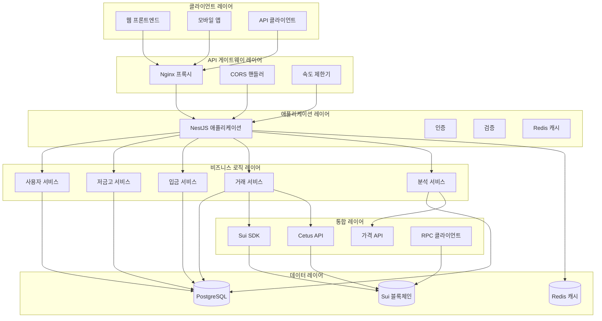

### 기술 스택

```yaml
백엔드 프레임워크:
  - NestJS: 데코레이터 기반 아키텍처를 가진 TypeScript 우선 프레임워크
  - Express: HTTP 서버 기반
  - TypeORM: PostgreSQL과의 객체 관계 매핑

블록체인 통합:
  - Sui SDK: 공식 Sui 블록체인 SDK
  - Cetus Protocol: 최적 라우팅을 위한 DEX 어그리게이터
  - 커스텀 RPC 클라이언트: 직접적인 블록체인 통신

데이터 레이어:
  - PostgreSQL: 주요 관계형 데이터베이스 (Neon Cloud)
  - Redis: 캐싱 및 세션 관리
  - TypeORM: 엔티티 관리 및 마이그레이션

API & 문서화:
  - Swagger/OpenAPI: 자동 생성 API 문서
  - Class Validator: 요청/응답 검증
  - Class Transformer: 데이터 변환

개발:
  - TypeScript: 타입 안전 개발
  - Jest: 단위 및 통합 테스트
  - ESLint/Prettier: 코드 품질 및 포맷팅
  - pnpm: 패키지 관리
```

---

## 🛠️ 구성 요소 설계

### 모듈 아키텍처

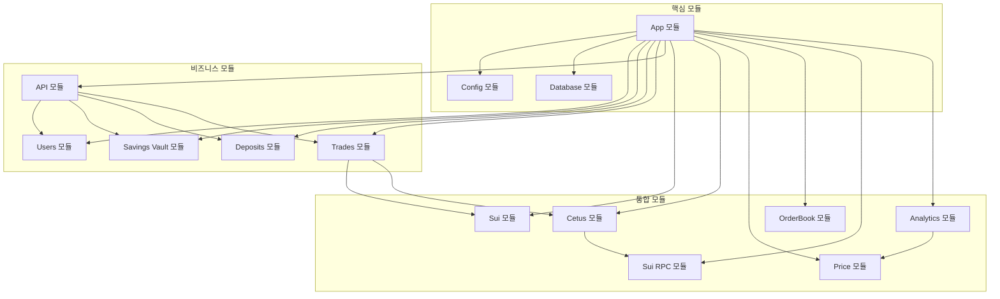

### 구성 요소 책임

#### 핵심 모듈

**App 모듈** (`app.module.ts`)
- 루트 애플리케이션 모듈
- 의존성 주입 구성
- 데이터베이스 연결 설정
- 환경 구성 관리

**Config 모듈**
- 환경 변수 관리
- 구성 검증
- 타입 안전한 구성 접근

**Database 모듈**
- PostgreSQL 연결 구성
- Neon Cloud용 SSL 설정
- 개발/프로덕션 데이터베이스 설정

#### 비즈니스 로직 모듈

**Users 모듈**
```typescript
// 책임:
- 지갑 기반 사용자 관리
- 사용자 등록 및 인증
- 사용자 프로필 관리
- 지갑 주소 검증

// 주요 구성 요소:
- UsersController: REST API 엔드포인트
- UsersService: 비즈니스 로직
- User Entity: 데이터베이스 모델
- CreateUserDto: 요청 검증
```

**Savings Vault 모듈**
```typescript
// 책임:
- DCA 전략 구성
- 저금고 생명주기 관리
- 투자 매개변수 (금액, 간격, 기간)
- 활성/비활성 상태 관리

// 주요 구성 요소:
- SavingsVaultController: CRUD 작업
- SavingsVaultService: 비즈니스 로직
- SavingsVault Entity: 구성 모델
- CreateSavingsVaultDto: 검증
```

**Deposits 모듈**
```typescript
// 책임:
- 입금 거래 추적
- 잔액 계산
- 거래 해시 기록
- 다중 통화 지원

// 주요 구성 요소:
- DepositsController: 입금 API
- DepositsService: 거래 로직
- Deposit Entity: 거래 모델
- CreateDepositDto: 검증
```

**Trades 모듈**
```typescript
// 책임:
- 거래 실행 추적
- 가격 기록
- 토큰 금액 계산
- 성능 메트릭

// 주요 구성 요소:
- TradesController: 거래 API
- TradesService: 실행 로직
- Trade Entity: 거래 모델
- CreateTradeDto: 검증
```

**API 모듈**
```typescript
// 책임:
- 고수준 DCA 작업
- 모듈 간 오케스트레이션
- 단순화된 클라이언트 인터페이스
- 비즈니스 워크플로 조정

// 주요 구성 요소:
- ApiController: DCA 워크플로
- 모든 비즈니스 모듈과 통합
- 복잡한 작업 오케스트레이션
```

#### 통합 모듈

**Sui 모듈**
```typescript
// 책임:
- Sui 블록체인 연결
- 거래 구축 및 서명
- 계정 관리
- 네트워크 구성

// 통합:
- Sui SDK 래퍼
- 연결 풀 관리
- 오류 처리 및 재시도
```

**Cetus 모듈**
```typescript
// 책임:
- DEX 어그리게이터 통합
- 최적 가격 발견
- 유동성 풀 분석
- 스왑 실행

// 기능:
- 풀 발견
- 라우트 최적화
- 슬리피지 계산
- 수수료 추정
```

**Price 모듈**
```typescript
// 책임:
- 실시간 가격 피드
- 과거 가격 데이터
- 다중 소스 집계
- 통화 변환

// 데이터 소스:
- CoinGecko API
- Cetus Protocol
- 대체 가격 피드
- 폴백 메커니즘
```

**Analytics 모듈**
```typescript
// 책임:
- 성능 계산
- CEX 비교 분석
- "알파" 계산
- 포트폴리오 분석

// 메트릭:
- DCA vs 고정 시간 구매
- 비용 평균화 효과
- 위험 조정 수익
- 시장 타이밍 분석
```

---

## 🔄 데이터 흐름

### DCA 작업 플로우

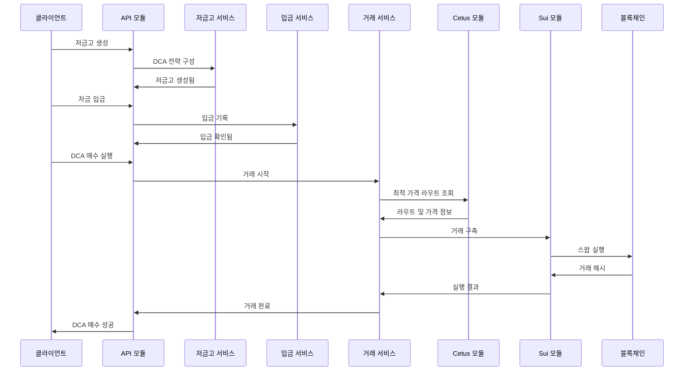

### 데이터 검증 플로우

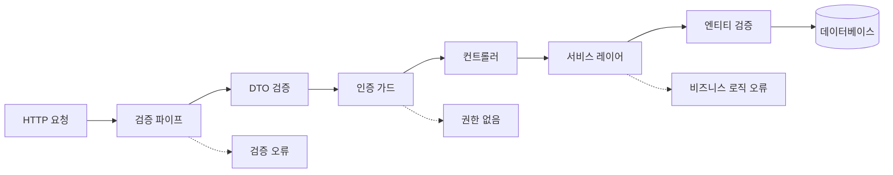

### 블록체인 통합 플로우

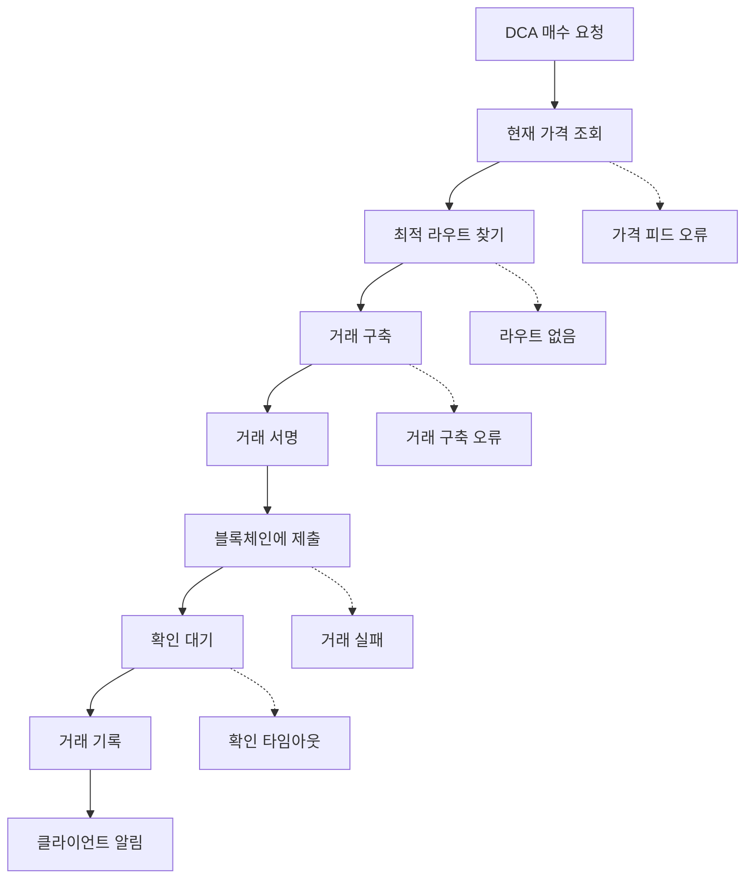

---

## 🗄️ 데이터베이스 설계

### 엔티티 관계 다이어그램

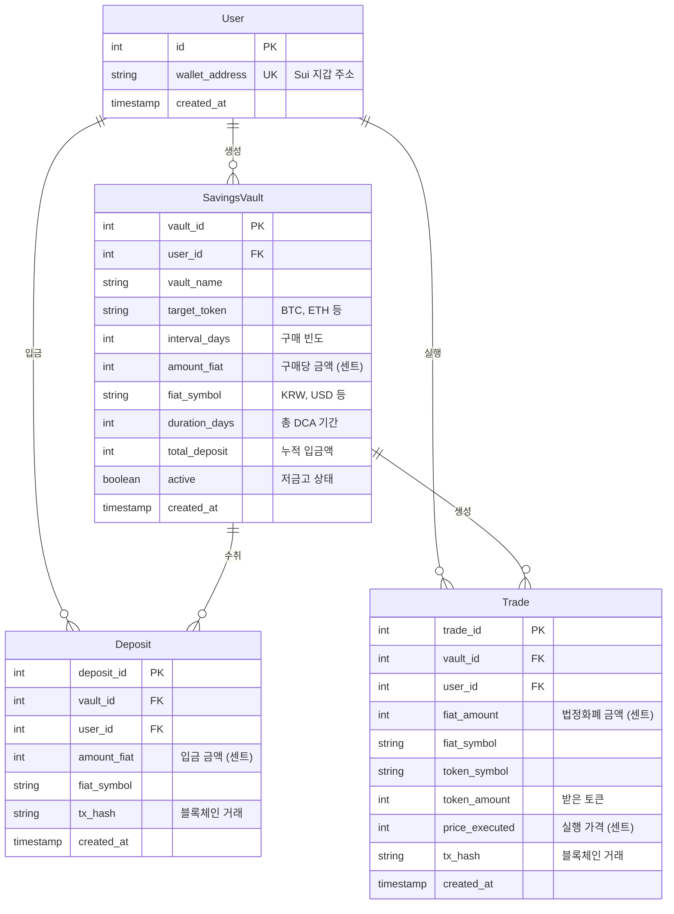

### 데이터베이스 스키마 세부사항

#### 인덱싱 전략
```sql
-- 성능 중요 인덱스
CREATE INDEX idx_users_wallet ON users(wallet_address);
CREATE INDEX idx_vaults_user ON savings_vault(user_id);
CREATE INDEX idx_vaults_active ON savings_vault(active);
CREATE INDEX idx_deposits_vault ON deposits(vault_id);
CREATE INDEX idx_deposits_user ON deposits(user_id);
CREATE INDEX idx_trades_vault ON trades(vault_id);
CREATE INDEX idx_trades_user ON trades(user_id);
CREATE INDEX idx_trades_created ON trades(created_at);

-- 복합 쿼리용 복합 인덱스
CREATE INDEX idx_deposits_user_vault ON deposits(user_id, vault_id);
CREATE INDEX idx_trades_user_vault ON trades(user_id, vault_id);
```

#### 데이터 타입 및 제약 조건
```sql
-- 금전 값은 정수로 저장 (센트)
-- 부동소수점 정밀도 문제 제거
-- 예: $100.00은 10000으로 저장

-- 지갑 주소: Sui 형식용 VARCHAR(66)
-- 거래 해시: 블록체인 호환용 VARCHAR(64)
-- 타임스탬프: 글로벌 호환용 TIMESTAMP WITH TIME ZONE
```

#### 마이그레이션 전략
```typescript
// 스키마 진화를 위한 TypeORM 마이그레이션
// 버전 제어된 데이터베이스 변경
// 프로덕션 안전성을 위한 롤백 기능

@Migration()
export class InitialSchema implements MigrationInterface {
  // 스키마 생성 및 수정 로직
}
```

---

## 🌐 API 설계

### RESTful API 원칙

```yaml
리소스 기반 URL:
  - GET /users/:id (/getUser/:id 아님)
  - POST /savings-vault (/createVault 아님)
  - DELETE /deposits/:id (/removeDeposit 아님)

HTTP 상태 코드:
  - 200: 응답 본문과 함께 성공
  - 201: 성공적으로 생성됨
  - 204: 응답 본문 없이 성공
  - 400: 잘못된 요청 (검증 오류)
  - 401: 권한 없음 (유효하지 않은 자격 증명)
  - 404: 리소스를 찾을 수 없음
  - 409: 충돌 (중복 리소스)
  - 422: 처리할 수 없는 엔티티 (비즈니스 로직 오류)
  - 500: 내부 서버 오류

콘텐츠 협상:
  - Accept: application/json
  - Content-Type: application/json
  - Charset: UTF-8
```

### API 버전 관리 전략

```typescript
// 주요 변경사항을 위한 URL 버전 관리
/api/v1/users
/api/v2/users

// 사소한 변경사항을 위한 헤더 버전 관리
Accept: application/vnd.blockberry.v1+json

// 하위 호환성을 위한 쿼리 매개변수 버전 관리
/api/users?version=1.1
```

### 오류 처리 패턴

```typescript
interface ApiError {
  success: false;
  error: string;
  statusCode: number;
  timestamp: string;
  path: string;
  details?: object;
}

// 글로벌 예외 필터
@Catch()
export class GlobalExceptionFilter implements ExceptionFilter {
  catch(exception: unknown, host: ArgumentsHost) {
    // 표준화된 오류 응답 형식
  }
}
```

### 요청/응답 변환

```typescript
// 자동 DTO 검증
@Post('/users')
async createUser(@Body() createUserDto: CreateUserDto) {
  // DTO가 자동으로 검증:
  // - 필수 필드
  // - 데이터 타입
  // - 커스텀 검증 규칙
}

// 응답 직렬화
@Exclude()
export class User {
  @Expose()
  id: number;
  
  @Expose()
  wallet_address: string;
  
  // 민감한 데이터는 응답에서 제외
  private_key?: string;
}
```

---

## 🌊 블록체인 통합

### Sui 블록체인 아키텍처

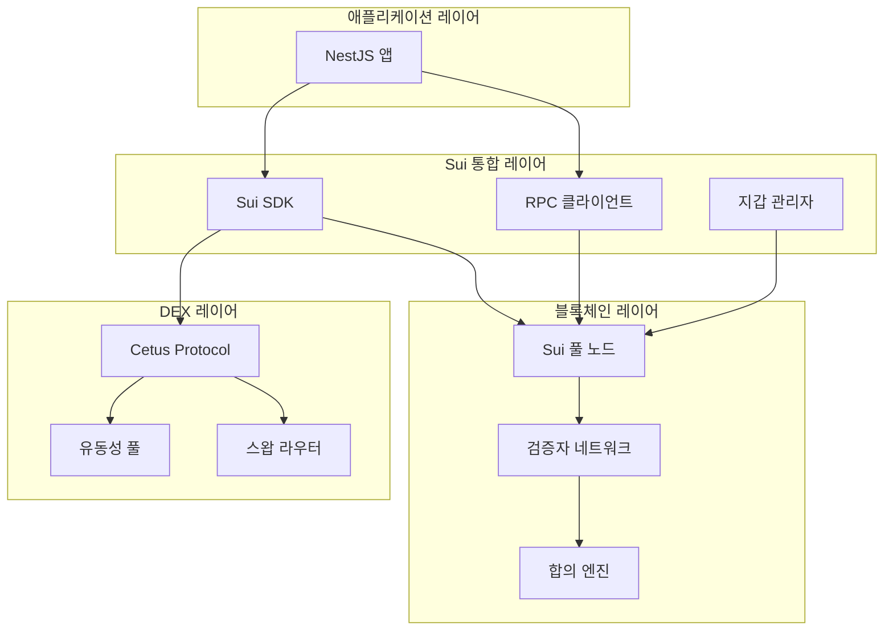

### 거래 생명주기

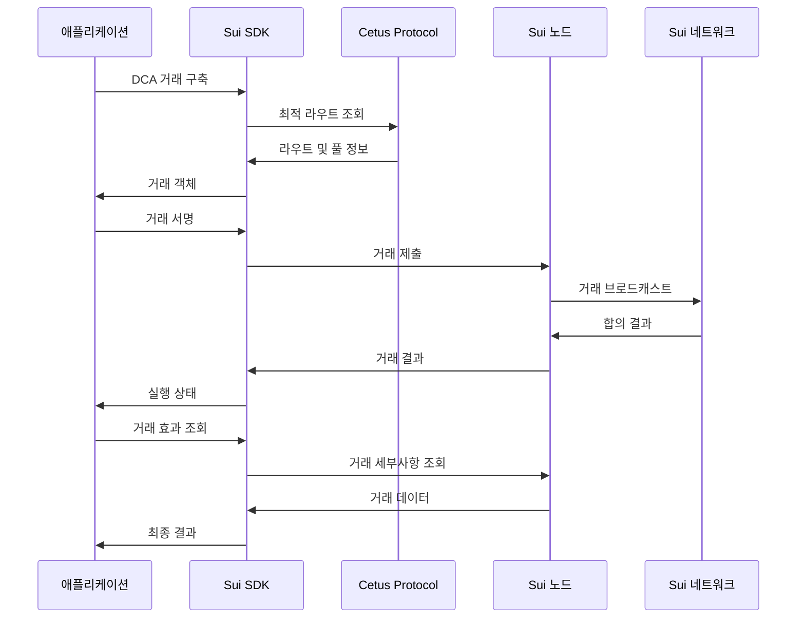

### 스마트 컨트랙트 통합

```typescript
// Cetus DEX 통합 예시
interface CetusSwapParams {
  pool_id: string;
  coin_type_a: string;
  coin_type_b: string;
  amount_in: number;
  min_amount_out: number;
  slippage_tolerance: number;
}

class CetusService {
  async getOptimalRoute(params: SwapParams): Promise<Route> {
    // 최적 가격을 위해 여러 풀 조회
    // 슬리피지 및 수수료 계산
    // 최적 실행 경로 반환
  }
  
  async executeSwap(route: Route): Promise<TransactionResult> {
    // 스왑 거래 구축
    // 필요시 멀티홉 라우팅 처리
    // 슬리피지 보호와 함께 실행
  }
}
```

### 상태 관리

```typescript
// 블록체인 상태 동기화
interface BlockchainState {
  last_processed_block: number;
  pending_transactions: string[];
  confirmed_transactions: string[];
  failed_transactions: string[];
}

// 거래 업데이트를 위한 이벤트 리스너
class BlockchainEventHandler {
  @EventPattern('transaction.confirmed')
  handleTransactionConfirmed(data: TransactionEvent) {
    // 확인된 거래로 데이터베이스 업데이트
    // 사용자 알림 트리거
    // 포트폴리오 계산 업데이트
  }
}
```

---

## 🔐 보안 아키텍처

### 인증 및 권한 부여

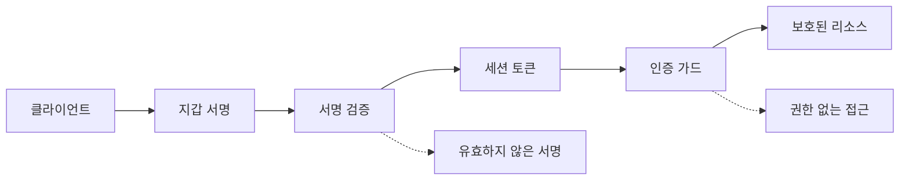

### 데이터 보호

```yaml
저장 중인 데이터:
  - 데이터베이스 암호화 (Neon Cloud)
  - 환경 변수 암호화
  - API 키 로테이션
  - 백업 암호화

전송 중인 데이터:
  - HTTPS/TLS 1.3
  - 인증서 피닝
  - API 요청 서명
  - WebSocket 암호화

메모리의 데이터:
  - 민감한 데이터 삭제
  - 메모리 누수 방지
  - 보안 랜덤 생성
  - 키 유도 함수
```

### 지갑 보안

```typescript
// 지갑 주소 검증
function validateSuiAddress(address: string): boolean {
  // Sui 주소 형식: 0x[64 hex characters]
  const suiAddressRegex = /^0x[a-fA-F0-9]{64}$/;
  return suiAddressRegex.test(address);
}

// 거래 서명 검증
async function verifyTransactionSignature(
  transaction: TransactionData,
  signature: string,
  publicKey: string
): Promise<boolean> {
  // 서명이 거래 및 공개 키와 일치하는지 검증
  // 논스 검증으로 재생 공격 방지
  // 거래가 변조되지 않았는지 확인
}
```

### 속도 제한 및 DDoS 보호

```typescript
// 속도 제한 구성
@ThrottlerGuard({
  ttl: 60, // 시간 창 (초)
  limit: 100, // 창당 최대 요청 수
})
export class ApiController {
  // 보호된 엔드포인트
}

// 비용이 많이 드는 작업에 대한 커스텀 속도 제한
@RateLimit({
  keyGenerator: (req) => req.user.wallet_address,
  windowMs: 15 * 60 * 1000, // 15분
  max: 10, // 15분당 DCA 실행 10회 제한
})
async executeDcaBuy() {
  // 비용이 많이 드는 블록체인 작업
}
```

---

## ⚡ 성능 고려사항

### 캐싱 전략

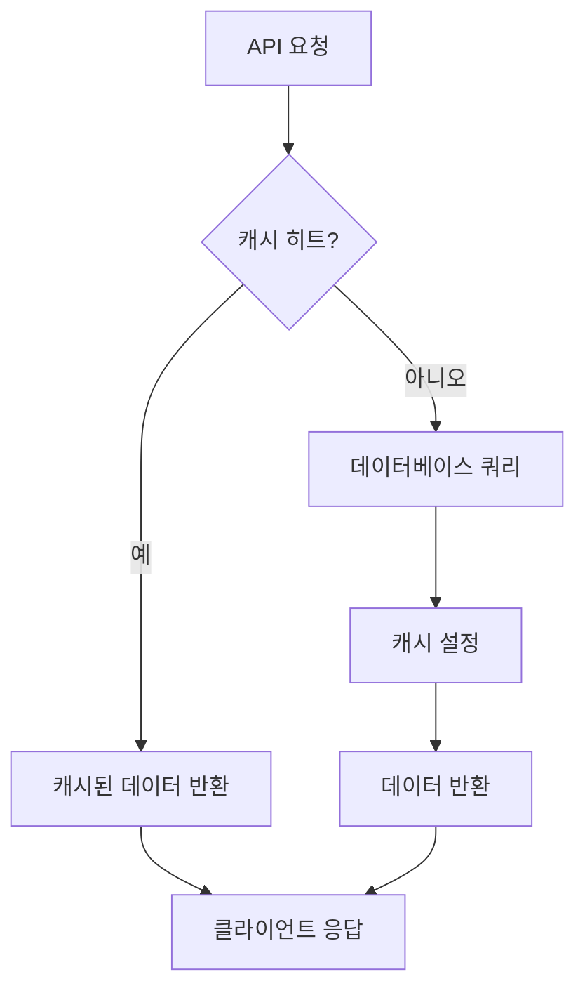

#### 캐시 레이어

```typescript
// 자주 접근하는 데이터를 위한 Redis 캐싱
@Injectable()
export class CacheService {
  // 가격 데이터 캐시 (5분 TTL)
  async getCachedPrice(symbol: string): Promise<Price | null> {
    return this.redis.get(`price:${symbol}`);
  }
  
  // 사용자 포트폴리오 캐시 (1시간 TTL)
  async getCachedPortfolio(userId: number): Promise<Portfolio | null> {
    return this.redis.get(`portfolio:${userId}`);
  }
  
  // 시장 데이터 캐시 (15분 TTL)
  async getCachedMarketData(pair: string): Promise<MarketData | null> {
    return this.redis.get(`market:${pair}`);
  }
}
```

### 데이터베이스 최적화

```sql
-- 쿼리 최적화 예시
-- 공통 쿼리를 위한 커버링 인덱스 사용
CREATE INDEX idx_trades_portfolio_calc 
  ON trades(user_id, vault_id, created_at, fiat_amount, token_amount);

-- 대용량 테이블을 위한 파티셔닝
CREATE TABLE trades_2024_q1 PARTITION OF trades
  FOR VALUES FROM ('2024-01-01') TO ('2024-04-01');

-- 복잡한 분석을 위한 구체화된 뷰
CREATE MATERIALIZED VIEW user_portfolio_summary AS
  SELECT 
    user_id,
    vault_id,
    SUM(fiat_amount) as total_invested,
    SUM(token_amount) as total_tokens,
    COUNT(*) as trade_count,
    AVG(price_executed) as avg_price
  FROM trades
  GROUP BY user_id, vault_id;
```

### 연결 풀링

```typescript
// 데이터베이스 연결 풀링
TypeOrmModule.forRootAsync({
  useFactory: (configService: ConfigService) => ({
    type: 'postgres',
    // 연결 풀 구성
    extra: {
      max: 20, // 최대 연결 수
      min: 5,  // 최소 연결 수
      acquireTimeoutMillis: 30000,
      createTimeoutMillis: 30000,
      destroyTimeoutMillis: 5000,
      idleTimeoutMillis: 30000,
      reapIntervalMillis: 1000,
      createRetryIntervalMillis: 200,
    },
  }),
});
```

### 비동기 처리

```typescript
// 백그라운드 작업 처리
@Injectable()
export class DcaScheduler {
  @Cron('0 */15 * * * *') // 15분마다
  async processPendingDcaOrders() {
    // DCA 주문을 비동기로 처리
    // 효율성을 위한 배치 처리
    // 실패를 우아하게 처리
  }
  
  @Cron('0 0 * * *') // 매일 자정
  async updatePortfolioCalculations() {
    // 포트폴리오 값 재계산
    // 분석 데이터 업데이트
    // 성능 보고서 생성
  }
}
```

---

## 🚀 배포 아키텍처

### 프로덕션 환경

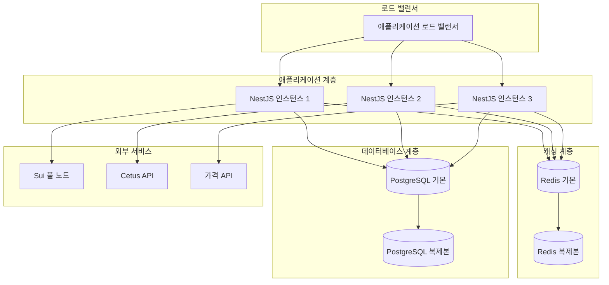

### 컨테이너 아키텍처

```dockerfile
# 멀티 스테이지 Docker 빌드
FROM node:18-alpine AS builder
WORKDIR /app
COPY package*.json ./
RUN npm ci --only=production

FROM node:18-alpine AS runtime
RUN addgroup -g 1001 -S nodejs
RUN adduser -S nestjs -u 1001
WORKDIR /app
COPY --from=builder --chown=nestjs:nodejs /app/node_modules ./node_modules
COPY --chown=nestjs:nodejs . .
USER nestjs
EXPOSE 3000
CMD ["node", "dist/main"]
```

### 환경 구성

```yaml
# 개발용 docker-compose.yml
version: '3.8'
services:
  app:
    build: .
    ports:
      - "3000:3000"
    environment:
      - NODE_ENV=development
      - DB_HOST=postgres
      - REDIS_URL=redis://redis:6379
    depends_on:
      - postgres
      - redis
  
  postgres:
    image: postgres:15-alpine
    environment:
      POSTGRES_DB: blockberry_dev
      POSTGRES_USER: dev_user
      POSTGRES_PASSWORD: dev_password
    volumes:
      - postgres_data:/var/lib/postgresql/data
  
  redis:
    image: redis:7-alpine
    volumes:
      - redis_data:/data

volumes:
  postgres_data:
  redis_data:
```

### 모니터링 및 관찰 가능성

```typescript
// 상태 확인
@Controller('health')
export class HealthController {
  @Get()
  @HealthCheck()
  check() {
    return this.health.check([
      () => this.db.pingCheck('database'),
      () => this.redis.pingCheck('redis'),
      () => this.sui.pingCheck('sui-node'),
    ]);
  }
}

// 애플리케이션 메트릭
@Injectable()
export class MetricsService {
  private readonly httpRequestDuration = new Histogram({
    name: 'http_request_duration_seconds',
    help: '초 단위 HTTP 요청 지속 시간',
    labelNames: ['method', 'route', 'status'],
  });
  
  private readonly dcaExecutionCounter = new Counter({
    name: 'dca_executions_total',
    help: '총 DCA 실행 횟수',
    labelNames: ['status', 'token'],
  });
}
```

---

## 🔗 통합 패턴

### 이벤트 주도 아키텍처

```typescript
// 느슨한 결합을 위한 도메인 이벤트
@EventsHandler(TradeExecutedEvent)
export class TradeExecutedHandler {
  async handle(event: TradeExecutedEvent) {
    // 포트폴리오 계산 업데이트
    // 사용자 알림 전송
    // 분석 업데이트 트리거
    // 캐시 업데이트
  }
}

// 복잡한 워크플로를 위한 사가 패턴
@Saga()
export class DcaExecutionSaga {
  @IsSagaStart()
  dcaOrderCreated = (events$: Observable<any>) => {
    return events$.pipe(
      ofType(DcaOrderCreatedEvent),
      map(event => new ValidateBalanceCommand(event.userId, event.amount))
    );
  };
}
```

### 회로 차단기 패턴

```typescript
// 복원력 있는 외부 API 호출
@Injectable()
export class CetusApiService {
  private circuitBreaker = new CircuitBreaker(
    this.callCetusApi.bind(this),
    {
      timeout: 5000,
      errorThresholdPercentage: 50,
      resetTimeout: 30000,
    }
  );
  
  async getPoolInfo(poolId: string): Promise<PoolInfo> {
    return this.circuitBreaker.fire(poolId);
  }
}
```

---

## 📈 확장성 고려사항

### 수평 확장

```yaml
애플리케이션 확장:
  - 상태 비저장 애플리케이션 설계
  - 로드 밸런서 분산
  - CPU/메모리 기반 자동 확장
  - 데이터베이스 연결 풀링

데이터베이스 확장:
  - 분석 쿼리용 읽기 복제본
  - 연결 풀링 및 최적화
  - 쿼리 최적화 및 인덱싱
  - 대용량 테이블 파티셔닝

캐시 확장:
  - Redis 클러스터 설정
  - 캐시 무효화 전략
  - 분산 캐싱 패턴
  - 캐시 워밍 전략
```

### 성능 모니터링

```typescript
// 커스텀 성능 추적
@Injectable()
export class PerformanceService {
  async trackDcaExecution(userId: number, startTime: number) {
    const duration = Date.now() - startTime;
    this.metrics.histogram('dca_execution_duration', duration);
    
    if (duration > 10000) { // > 10초
      this.logger.warn('느린 DCA 실행', { userId, duration });
    }
  }
}
```

---

이 아키텍처 문서는 Blockberry App의 설계 패턴, 통합 전략 및 확장성 고려사항에 대한 포괄적인 개요를 제공합니다. 모듈식 설계는 유지보수성을 보장하고 이벤트 주도 패턴은 향후 개선을 위한 유연성을 제공합니다.

---

*마지막 업데이트: 2024-09-20*