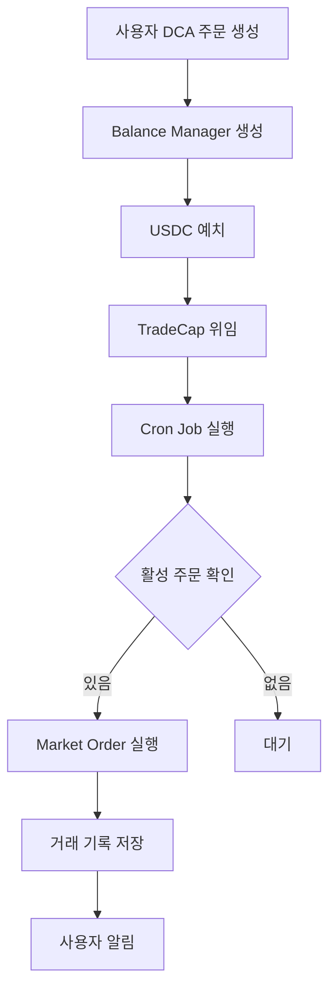

# DCA (Dollar Cost Averaging) 구현 작업 계획

## 📋 프로젝트 개요
Sui 블록체인의 DeepBook V3를 활용한 자동화된 DCA(정액 분할 매수) 플랫폼 구현

### 목표
- 사용자가 USDC를 예치하고 일정 기간 동안 자동으로 BTC/SUI를 매수하는 시스템 구축
- Non-custodial 방식으로 사용자 자산 안전성 보장
- 완전 자동화된 거래 실행 시스템

## 🏗️ 아키텍처 구성

### 1. Frontend (React/Next.js)
- [x] DCABuyForm 컴포넌트
- [x] USDC 잔액 조회 Hook
- [x] Sui 지갑 연결
- [ ] Balance Manager 상태 표시
- [ ] 거래 내역 조회 UI

### 2. Backend (Next.js API Routes)
- [ ] Balance Manager 관리 API
- [ ] 자금 예치/인출 API
- [ ] TradeCap 위임 API
- [ ] 거래 실행 API
- [ ] 거래 내역 조회 API

### 3. Blockchain (Sui/DeepBook V3)
- [ ] DeepBook V3 SDK 통합
- [ ] Balance Manager 생성/관리
- [ ] 거래 실행 로직

### 4. Database (PostgreSQL)
- [x] User 엔티티
- [x] SavingsVault 엔티티
- [x] Trade 엔티티
- [ ] BalanceManager 엔티티 추가
- [ ] DCAOrder 엔티티 추가

## 📝 상세 작업 목록

### Phase 1: DeepBook V3 통합 준비 (Week 1)

#### Task 1.1: DeepBook V3 SDK 설치 및 설정
```bash
pnpm add @mysten/deepbook-v3
```
- [ ] SDK 설치
- [ ] 환경변수 설정 (.env)
  - PLATFORM_PRIVATE_KEY
  - DEEPBOOK_PACKAGE_ID
  - 네트워크별 풀 주소

#### Task 1.2: DeepBookMarketMaker 클래스 구현
```typescript
// src/lib/deepbook/DeepBookMarketMaker.ts
class DeepBookMarketMaker {
  constructor(privateKey: string, env: 'testnet' | 'mainnet')
  async createBalanceManager(): Promise<string>
  async depositToManager(managerId: string, amount: number)
  async delegateTradeCap(managerId: string, platformAddress: string)
  async executeMarketOrder(poolKey: string, amount: number)
}
```
- [ ] 클래스 구조 설계
- [ ] Balance Manager 관리 메서드
- [ ] 거래 실행 메서드
- [ ] 에러 처리 로직

### Phase 2: API 엔드포인트 구현 (Week 1-2)

#### Task 2.1: Balance Manager API
```typescript
// src/app/api/dca/balance-manager/route.ts
POST /api/dca/balance-manager/create
GET /api/dca/balance-manager/[userId]
```
- [ ] Balance Manager 생성 엔드포인트
- [ ] Balance Manager 조회 엔드포인트
- [ ] DB 저장 로직

#### Task 2.2: 자금 관리 API
```typescript
// src/app/api/dca/deposit/route.ts
POST /api/dca/deposit
POST /api/dca/withdraw
GET /api/dca/balance/[managerId]
```
- [ ] USDC 예치 엔드포인트
- [ ] TradeCap 위임 로직
- [ ] 잔액 조회 엔드포인트

#### Task 2.3: 거래 실행 API
```typescript
// src/app/api/dca/trade/route.ts
POST /api/dca/trade/execute
GET /api/dca/trade/history
```
- [ ] 수동 거래 실행 엔드포인트
- [ ] 거래 내역 조회 엔드포인트
- [ ] 거래 상태 추적

### Phase 3: DCA 자동화 시스템 (Week 2)

#### Task 3.1: DCA 주문 관리 서비스
```typescript
// src/lib/services/dca.service.ts
class DCAService {
  async createDCAOrder(userId: string, params: DCAParams)
  async pauseDCAOrder(orderId: string)
  async resumeDCAOrder(orderId: string)
  async cancelDCAOrder(orderId: string)
}
```
- [ ] DCA 주문 생성/수정/취소
- [ ] 주문 상태 관리
- [ ] 검증 로직

#### Task 3.2: 자동 거래 실행 스케줄러
```typescript
// src/lib/scheduler/dca-scheduler.ts
```
- [ ] Cron Job 설정 (매일 정해진 시간)
- [ ] 활성 DCA 주문 조회
- [ ] 일일 거래 실행
- [ ] 실패 재시도 로직
- [ ] 알림 시스템

### Phase 4: Frontend 통합 (Week 2-3)

#### Task 4.1: Balance Manager UI
```typescript
// src/components/dca/BalanceManagerStatus.tsx
```
- [ ] Balance Manager 생성 버튼
- [ ] 상태 표시 (생성됨/미생성)
- [ ] 잔액 표시

#### Task 4.2: DCA 주문 관리 UI
```typescript
// src/components/dca/DCAOrderList.tsx
// src/components/dca/DCAOrderDetail.tsx
```
- [ ] 활성 DCA 주문 목록
- [ ] 주문 상세 정보
- [ ] 일시정지/재개/취소 버튼

#### Task 4.3: 거래 내역 UI
```typescript
// src/components/dca/TradeHistory.tsx
```
- [ ] 거래 내역 테이블
- [ ] 필터링/정렬
- [ ] 거래 상세 모달

### Phase 5: 테스트 및 보안 (Week 3)

#### Task 5.1: 단위 테스트
- [ ] DeepBookMarketMaker 테스트
- [ ] DCAService 테스트
- [ ] API 엔드포인트 테스트

#### Task 5.2: 통합 테스트
- [ ] End-to-End 플로우 테스트
- [ ] Testnet 거래 테스트
- [ ] 에러 시나리오 테스트

#### Task 5.3: 보안 검토
- [ ] Private Key 관리 검증
- [ ] TradeCap 권한 검증
- [ ] Rate Limiting 구현
- [ ] 입력 검증 강화

## 🔧 기술 스택

### Dependencies 추가 필요
```json
{
  "dependencies": {
    "@mysten/deepbook-v3": "latest",
    "node-cron": "^3.0.3",
    "bull": "^4.11.5"  // 작업 큐 관리 (선택사항)
  }
}
```

### 환경 변수 설정
```env
# DeepBook V3
DEEPBOOK_PACKAGE_ID=0x...
PLATFORM_PRIVATE_KEY=...
PLATFORM_ADDRESS=0x...

# Network Config
NEXT_PUBLIC_ENV=testnet

# Pool Addresses
TESTNET_DEEP_SUI_POOL=0x...
TESTNET_SUI_USDC_POOL=0x...
MAINNET_SUI_USDC_POOL=0x...
MAINNET_WBTC_USDC_POOL=0x...
```

## 📊 데이터베이스 스키마 추가

### BalanceManager 테이블
```sql
CREATE TABLE balance_managers (
  id SERIAL PRIMARY KEY,
  user_id INTEGER REFERENCES users(id),
  manager_address VARCHAR(255) UNIQUE NOT NULL,
  trade_cap_id VARCHAR(255),
  created_at TIMESTAMP DEFAULT CURRENT_TIMESTAMP,
  updated_at TIMESTAMP DEFAULT CURRENT_TIMESTAMP
);
```

### DCAOrder 테이블
```sql
CREATE TABLE dca_orders (
  id SERIAL PRIMARY KEY,
  user_id INTEGER REFERENCES users(id),
  vault_id INTEGER REFERENCES savings_vault(vault_id),
  balance_manager_id INTEGER REFERENCES balance_managers(id),
  target_token VARCHAR(20) NOT NULL,
  daily_amount DECIMAL(18, 8) NOT NULL,
  total_amount DECIMAL(18, 8) NOT NULL,
  executed_amount DECIMAL(18, 8) DEFAULT 0,
  start_date DATE NOT NULL,
  end_date DATE NOT NULL,
  status VARCHAR(20) DEFAULT 'active',
  last_execution_date DATE,
  created_at TIMESTAMP DEFAULT CURRENT_TIMESTAMP,
  updated_at TIMESTAMP DEFAULT CURRENT_TIMESTAMP
);
```

## 🚀 실행 플로우

### 사용자 플로우
1. 지갑 연결 → USDC 잔액 확인
2. DCA 설정 (금액, 기간, 타겟 토큰)
3. Balance Manager 생성 (최초 1회)
4. USDC 예치 (총 금액)
5. TradeCap 위임 → 플랫폼에 거래 권한 부여
6. 매일 자동 거래 실행
7. 거래 내역 확인

### 시스템 플로우


## ⏰ 일정

### Week 1 (2024-09-20 ~ 2024-09-27)
- DeepBook V3 SDK 통합
- 기본 API 구조 구축
- Database 스키마 업데이트

### Week 2 (2024-09-27 ~ 2024-10-04)
- DCA 자동화 시스템 구현
- Frontend 통합 시작
- Testnet 테스트

### Week 3 (2024-10-04 ~ 2024-10-11)
- UI/UX 개선
- 통합 테스트
- 보안 검토

### Week 4 (2024-10-11 ~ 2024-10-18)
- 버그 수정
- 성능 최적화
- Mainnet 준비

## ✅ 완료 기준

### MVP (Minimum Viable Product)
- [ ] Balance Manager 생성 가능
- [ ] USDC 예치 및 TradeCap 위임 가능
- [ ] 수동으로 거래 실행 가능
- [ ] 거래 내역 조회 가능

### Full Product
- [ ] 자동화된 일일 거래 실행
- [ ] DCA 주문 관리 (생성/수정/취소)
- [ ] 실시간 잔액 업데이트
- [ ] 거래 알림 시스템
- [ ] 상세한 거래 분석 대시보드

## 🎯 성공 지표

### 기술적 지표
- 거래 성공률 > 95%
- 거래 실행 지연 < 5초
- 시스템 가동률 > 99.9%

### 사용자 경험 지표
- 설정 완료까지 < 3분
- 거래 내역 로딩 < 2초
- 에러율 < 1%

## 📚 참고 자료

### 공식 문서
- [DeepBook V3 Documentation](https://docs.sui.io/standards/deepbookv3)
- [Sui TypeScript SDK](https://docs.sui.io/references/ts-sdk)
- [DeepBook V3 GitHub](https://github.com/MystenLabs/deepbookv3)

### 레퍼런스 코드
- `/ref/1_create_balance_manager.ts` - Balance Manager 생성
- `/ref/2_deposit_and_delegate_tradecap.ts` - 자금 예치 및 권한 위임
- `/ref/3_trading_by_platform.ts` - 플랫폼 거래 실행

## 🔒 보안 고려사항

### Private Key 관리
- 환경 변수로 관리
- KMS 사용 검토
- 다중 서명 지갑 고려

### 거래 제한
- 일일 거래 한도 설정
- Rate Limiting
- 이상 거래 감지

### 감사 로그
- 모든 거래 기록
- 권한 변경 추적
- 정기 보안 감사

---

*Last Updated: 2024-09-20*
*Version: 1.0.0*